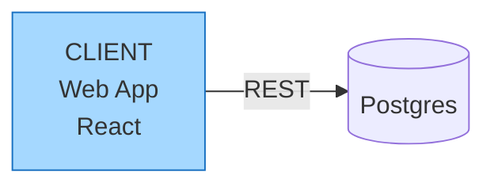

# RMK Layout Annotation, version 1

Specification of the `%% rmk-layout` comment that `@react-markdown-kit/mermaid`
writes into a ```` ```mermaid ```` flowchart to persist the geometry Mermaid
syntax cannot express.

Status: stable. Reference implementation: `src/core/layout-annotation.ts`.
Machine-readable schema: `LAYOUT_ANNOTATION_JSON_SCHEMA`, exported from the
package root.

The key words MUST, MUST NOT, SHOULD and MAY are to be interpreted as
described in RFC 2119.

## 1. Scope

A Mermaid flowchart states nodes, edges, text, direction and colours. It has
no syntax for positions, sizes, stroke widths, connector routing, waypoints,
attach points, free text or connectors that are not bound at both ends. The
annotation carries exactly that remainder, in one comment line, so that:

- every Mermaid renderer (Mermaid.js, GitHub, GitLab, Notion, Obsidian)
  shows the flowchart unchanged and ignores the line, and
- this package reproduces the drawing exactly as it was saved.

The annotation never repeats information the syntax carries. The syntax is
authoritative for the graph; the annotation is authoritative for geometry.

## 2. Line grammar

```abnf
annotation = *WSP "%%" 1*WSP "rmk-layout" 1*WSP "v" major 1*WSP payload *WSP
major      = 1*DIGIT                ; this specification: "1"
payload    = object                 ; RFC 8259 JSON object, no line breaks
```

- The line MUST be a Mermaid comment: `%%` is the first non-blank content.
  The marker word MUST be followed by whitespace, so `%% rmk-layouts` is an
  ordinary comment.
- The payload MUST be a single JSON object and MUST end the line.
- The line MAY appear anywhere in the fence body. The writer places it last.
  Its position carries no meaning.
- A fence MUST carry at most one annotation.

Example:

````md

````

## 3. Payload

Every member is optional. An empty object `{}` is valid and means "automatic
layout". Units are CSS pixels; the origin is the canvas top-left, x grows
right, y grows down.

### 3.1 Top level

| Member | Type | Meaning |
|---|---|---|
| `canvasHeight` | number ≥ 80 | Canvas height. |
| `canvasWidth` | number ≥ 120 | Logical canvas width. When set, the drawing scales down to fit narrower layouts. |
| `width` | `"full"` \| `"text"` \| `"content"` | Block width in the page. Default `"full"`. |
| `description` | string | Accessible description. The title is the Mermaid front matter `title`. |
| `nodes` | object | Per-node geometry, keyed by Mermaid node id. See 3.2. |
| `edges` | object | Per-edge geometry, keyed by edge key. See 3.3 and 4. |
| `texts` | array of shape | Free-floating text shapes, as full `drawing` shapes with `type: "text"`. |
| `loose` | array of shape | Connectors not bound at both ends, as full `drawing` shapes with `type: "arrow"` or `"line"`. |

Shape objects in `texts` and `loose` follow the ```` ```drawing ```` shape
format in `DRAWING_FORMAT.md`. Bindings inside `loose` reference Mermaid
node ids.

### 3.2 Node entry

| Member | Type | Meaning |
|---|---|---|
| `x`, `y` | number | Top-left of the bounding box. |
| `width`, `height` | number ≥ 0 | Size of the bounding box. |
| `strokeWidth` | number ≥ 0 | Outline width. The editor writes `2`. |
| `slots` | array of `"label"` \| `"text"` \| `"footer"`, distinct | Which card slots the node text fills. See 5. |
| `type` | `"cloud"` \| `"actor"` | The shape, when Mermaid has no bracket for it. Every other shape is stated by the bracket in the syntax. |

Node colours are never in the annotation. They are `style <id> fill:…,stroke:…`
lines in the syntax.

### 3.3 Edge entry

| Member | Type | Meaning |
|---|---|---|
| `id` | string | The connector shape id. Generated when omitted. |
| `x`, `y` | number | Start point. Approximate: a bound endpoint is re-anchored to its node. |
| `width`, `height` | number | Delta to the end point. May be negative. |
| `stroke`, `fill` | string | CSS colours of the connector and of the arrowhead interior. |
| `strokeWidth` | number ≥ 0 | Line width. |
| `routing` | `"elbow"` | Right-angled auto-routed path. Omit for straight. |
| `elbow` | number in [0, 1] | Middle segment position of a three-segment elbow. |
| `waypoints` | array of `{x, y}` | Explicit path. Takes precedence over `routing`. |
| `start`, `end` | anchor | How the endpoint attaches to the `from` and `to` node. |

An anchor is a `drawing` binding without its `id`:

| Member | Type | Meaning |
|---|---|---|
| `fixedPoint` | `[number, number]` | Attach point as a ratio of the node's bounding box. `[0.5, 0]` is the top edge midpoint. Omit to auto-aim from the node centre. |
| `mode` | `"orbit"` \| `"inside"` | `"orbit"` (default) projects onto the outline with a 6px gap; `"inside"` pins the point exactly. |

The edge's endpoints, label, direction and line style (`-->`, `---`, `<-->`)
are stated by the syntax only.

## 4. Edge keys

Edges are keyed by their endpoints, so an entry survives edits that reorder,
insert or remove other edge statements.

- The key of an edge from node `a` to node `b` is `a->b`.
- When several edges share the same `from` and `to`, they are numbered in
  statement order after `&`-group and chain expansion: the first is `a->b`,
  the second `a->b#2`, the third `a->b#3`.
- A bidirectional edge `a <--> b` has the key `a->b`.

Node ids match `[A-Za-z0-9_-]+`, so `->` and `#` are unambiguous separators.

## 5. Text slots

A card has three text slots: `label` (small heading), `text` (main content)
and `footer` (small line at the bottom). Mermaid has one text per node, so
the writer joins the non-empty slots in that order with `<br/>`, and `slots`
records which slots were present.

The reader splits the node text on line breaks and assigns:

- the first line to `label`, when `slots` contains `"label"`;
- the last remaining line to `footer`, when `slots` contains `"footer"`;
- the remaining lines, joined by line breaks, to `text`.

Without `slots`, all text is `text`. An empty `slots` array means the node
has no text; the syntax then shows the node id as a placeholder. The writer
omits `slots` when the only slot is `text`.

## 6. Reading

A reader MUST apply these rules in order.

1. **Detection.** A comment line matching `%%` + whitespace + `rmk-layout` +
   a non-identifier character is an annotation candidate. Any other comment
   is ignored.
2. **Grammar.** A candidate that does not match the grammar in section 2 is
   invalid.
3. **Version.** A candidate whose major version is not `1` is invalid. A
   reader MUST NOT attempt to interpret a payload of another major version.
4. **JSON.** A payload that is not a JSON object is invalid.
5. **Validation.** Every known member MUST have the type and range in
   section 3. The first violation makes the annotation invalid. The reader
   reports the violation with a dotted path (`nodes.web.x`,
   `edges.a->b.start.fixedPoint`, `texts.0.type`).
6. **Unknown members.** Members not defined here MUST be ignored at every
   level. This is how a minor revision adds fields.
7. **Stale entries.** `nodes` keys and `edges` keys that name nothing in the
   flowchart MUST be ignored. They are not an error; they are what remains
   after a node or edge is deleted in the syntax.
8. **Multiplicity.** A fence with more than one candidate is invalid as a
   whole.
9. **Clamping.** Numbers within type but outside range (a `canvasHeight`
   below 80, a `fixedPoint` component outside [0, 1], a colour that is not a
   safe CSS colour) are clamped or replaced with defaults by the drawing
   normaliser, as for the ```` ```drawing ```` format.

An invalid annotation is rejected as a whole: nothing in it is applied.
The flowchart is still read and laid out automatically, and the rejection is
reported as the diagnostic `DIAGRAM_LAYOUT_INVALID` (severity `warning`,
`path` set when the violation has one). The syntax error diagnostic
`DIAGRAM_INVALID` is reserved for a flowchart that cannot be read at all.

Diagnostic messages never contain payload values.

## 7. Writing

A conforming writer emits the canonical form:

- one line, placed last in the fence body, indented like the statements;
- `%% rmk-layout v1 ` followed by the payload as compact JSON (no
  whitespace);
- members in the order of the tables in section 3; `nodes` in node
  declaration order; `edges` in statement order;
- non-integer numbers rounded to two decimals;
- optional members omitted when absent; `texts` and `loose` omitted when
  empty; `slots` omitted when it would be `["text"]`;
- no member the syntax already states (colours, edge endpoints, labels).

The canonical form makes the line deterministic for a given drawing, so
version control diffs show only what changed.

## 8. Guarantees

For any normalised `DrawingData` whose node ids are valid Mermaid ids:

- `parse(write(d))` deep-equals `d` (lossless round trip);
- `write(parse(write(d)))` equals `write(d)` byte for byte (fixed point).

Node ids that are not valid Mermaid ids are rewritten (`my-box` becomes
`my_box`, duplicates get a `_2` suffix); the round trip then preserves
everything except those ids. Both guarantees are covered by
`tests/mermaid-parse.test.ts` and `tests/layout-annotation.test.ts`.

An untouched fence is written back byte for byte by the editor, whether or
not it carries an annotation.

## 9. Compatibility

- **Major version** (`v1`, `v2`): a change a version 1 reader cannot apply
  safely: a member changes meaning or type, a key scheme changes, a default
  changes. A new major gets a new marker version. Readers reject majors they
  do not know (section 6, rule 3).
- **Minor revision**: adding an optional member, or accepting a wider range.
  No version change. Older readers ignore the new member.
- A writer MUST NOT emit members from a later revision than it reads.
- Removed or renamed members require a new major version.

The JSON Schema describes what a version 1 writer emits, so it sets
`additionalProperties: false` at every level. Use it to validate generated
annotations before embedding them. Readers stay lenient per section 6.

## 10. Security

- The payload is data. It is never evaluated, and no member is ever
  interpreted as a URL, a script or markup.
- Colours pass the drawing format's safe-colour check (`#hex`, `rgb()`,
  `hsl()`, `oklch()`, `oklab()` and colour keywords, at most 64 characters).
  Anything else falls back to the default.
- Shape counts are bounded by the drawing format limit (5000 shapes per
  drawing, including `texts` and `loose`).
- A malformed annotation can never make a fence unreadable: the flowchart
  still renders, and the failure is a diagnostic, not an exception.

## 11. Programmatic use

```ts
import {
  readLayoutAnnotation,
  writeLayoutAnnotation,
  LAYOUT_ANNOTATION_JSON_SCHEMA,
  LAYOUT_ANNOTATION_MARKER,   // 'rmk-layout'
  LAYOUT_ANNOTATION_VERSION,  // 1
} from '@react-markdown-kit/mermaid'

const read = readLayoutAnnotation('%% rmk-layout v1 {"canvasHeight":260}')
// { kind: 'annotation', annotation: { canvasHeight: 260 } }
// { kind: 'invalid', problem: { message, path? } }
// { kind: 'none' } for any other line

writeLayoutAnnotation({ canvasHeight: 260, nodes: {}, edges: {} })
// '%% rmk-layout v1 {"canvasHeight":260,"nodes":{},"edges":{}}'
```

Types: `LayoutAnnotation`, `LayoutNode`, `LayoutEdge`, `LayoutAnchor`,
`LayoutSlot`, `LayoutProblem`, `LayoutRead`.
