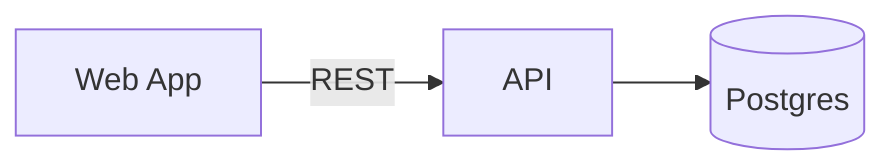
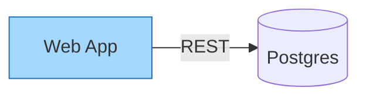

# @react-markdown-kit/mermaid

Mermaid flowcharts as Markdown, as a plugin. A ```` ```mermaid ```` fence
holds the diagram, the renderer draws it as static SVG, the editor opens it
on a drawing canvas and writes it back as Mermaid syntax, and the template
plugin leaves it alone. The same fence renders on GitHub, GitLab, Notion and
Obsidian, because it is plain Mermaid.

```bash
npm install @react-markdown-kit/renderer @react-markdown-kit/mermaid
```

```tsx
import Markdown, { defineMarkdownPreset } from '@react-markdown-kit/renderer'
import { mermaid } from '@react-markdown-kit/mermaid'
import '@react-markdown-kit/mermaid/styles.css'

const preset = defineMarkdownPreset({ extensions: [mermaid()] })

<Markdown preset={preset}>{content}</Markdown>
```

````md

````

## What the editor writes

Mermaid has no syntax for positions, sizes, stroke widths, elbow routing or
free text, so the canvas writes the graph as ordinary Mermaid and the
geometry as one **layout annotation**, a `%% rmk-layout v1 {…}` comment on
the last line. Mermaid, GitHub and every other renderer ignore the comment;
this plugin reads it back, so a drawing round-trips without loss and a
hand-written flowchart with no annotation is auto-laid out. An untouched
fence is written back byte for byte.

````md

````

The annotation is a versioned, validated format, specified in
[`LAYOUT_ANNOTATION.md`](./LAYOUT_ANNOTATION.md) and shipped with the
package: a line grammar, a payload with every member typed, edges keyed by
their endpoints (`web->api`) so an entry survives edits to the syntax,
fail-closed validation with a dotted path in the `DIAGRAM_LAYOUT_INVALID`
diagnostic, unknown members ignored for forward compatibility, and a
canonical serialization so diffs show only what changed. The syntax stays
authoritative for the graph and colours; the annotation never repeats them.
`LAYOUT_ANNOTATION_JSON_SCHEMA` is the same contract for validators and
generators; `readLayoutAnnotation` and `writeLayoutAnnotation` are the
reference reader and writer.

The flowchart subset covers node shapes (`[ ]`, `( )`, `([ ])`, `(( ))`,
`{ }`, `{{ }}`, `[( )]`, `[[ ]]`, `> ]`), edges with labels in either
spelling, lines, arrows and bidirectional arrows, chains, `&` groups,
`subgraph … end`, `style` colours and front-matter titles. Other Mermaid
diagram types (sequence, class, Gantt, …) stay ordinary code blocks, and
`classDef`, `click` and `linkStyle` are ignored.

## The plugin is the API

`mermaid()` is a plain `MarkdownExtension` and the package's only way in.
The renderer, the editor and the template plugin each read the capability
they understand.

| Capability | What it does |
| --- | --- |
| `syntax` | A ```` ```mermaid ```` flowchart (or a legacy ```` ```diagram ```` / ```` ```drawing ```` JSON fence) becomes a `diagram` node, parsed once; it serializes back to the same fence |
| `renderer` | The node becomes `<figure data-rmk-diagram>` holding a static SVG. No script, no `foreignObject`, no DOM needed |
| `template` | The payload is literal. `{{placeholders}}` inside it are never resolved |
| `editor` | On `@react-markdown-kit/mermaid/editor` only: a Lexical node, a canvas, an insert-diagram toolbar button |

The root entry loads no React and no Lexical, so a Node service can render or
template diagrams without installing either.

## Legacy JSON fences

The ```` ```diagram ```` skeleton and ```` ```drawing ```` payload formats
from `@zuilib/text-editor` are still read, so existing documents keep
rendering and open on the canvas. The first edit rewrites the block as
```` ```mermaid ````. `DRAWING_FORMAT.md` in this package specifies all three,
and `DRAWING_SKELETON_JSON_SCHEMA` and `DRAWING_DATA_JSON_SCHEMA` describe
the JSON ones for generators and validators.

## Editor

```tsx
import { MarkdownEditor } from '@react-markdown-kit/editor'
import { mermaid } from '@react-markdown-kit/mermaid/editor'

<MarkdownEditor extensions={[mermaid()]} value={value} onChange={setValue} />
```

An untouched diagram writes back byte for byte. Editing one writes
```` ```mermaid ```` with the layout annotation. **Copy as Mermaid** on the
canvas copies the plain flowchart without it. Options: `style` (`clean` or
hand-drawn `ink`) and `newBlockWidth`. The canvas was ported from `@zuilib/text-editor` (MIT), so
the kit keeps its no-design-system rule.

## Styling and safety

`styles.css` is optional and scoped to `.rmk-document` and `.rmk-editor`,
every value a `--rmk-diagram-*` custom property. Shape colours are content.
The parser accepts only the documented shapes, colours and numbers, never
throws, and invalid JSON renders as visible source with a `DIAGRAM_INVALID`
diagnostic. The SVG contains no script, no event attribute and no URL.

## License

MIT. The drawing model and canvas are ported from `@zuilib/text-editor`, MIT.
