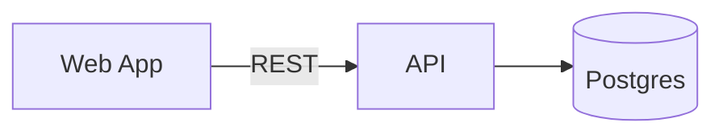
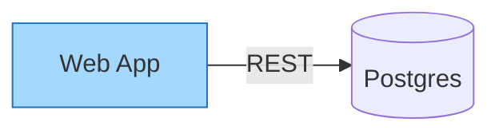

# @react-markdown-kit/mermaid

Mermaid in React, as a Markdown plugin, plus a Mermaid visual editor that
writes plain Mermaid back. A ```` ```mermaid ```` fence holds the diagram, the
renderer draws flowcharts and sequence diagrams as static SVG with no
Mermaid.js runtime, the editor opens flowcharts and sequence diagrams on a
canvas and every other kind in a source editor with a preview, and the
template plugin leaves
the fence alone. Every other Mermaid type is shown as source, or drawn by the
host through the `/client` fallback entry.

```bash
npm install @react-markdown-kit/renderer @react-markdown-kit/mermaid
```

```tsx
import Markdown, { defineMarkdownPreset } from '@react-markdown-kit/renderer'
import { mermaid } from '@react-markdown-kit/mermaid'
import '@react-markdown-kit/mermaid/styles.css'

const preset = defineMarkdownPreset({ extensions: [mermaid()] })

export function Doc({ content }: { content: string }) {
  return <Markdown preset={preset}>{content}</Markdown>
}
```

````md

````

## Links

- Docs: [Mermaid diagrams](https://docs.reactmarkdownkit.com/docs/mermaid)
- Demo: [mermaid.reactmarkdownkit.com](https://mermaid.reactmarkdownkit.com),
  the visual editor in the browser
- Source: [github.com/mahuzedada/react-markdown-kit](https://github.com/mahuzedada/react-markdown-kit)

## Diagram kinds

The plugin reads the first word of the fence, after front matter, directives
and comments, as Mermaid's own `detectType` does. Keywords are case-sensitive.

| Kind | Header | Rendered | Edited |
| --- | --- | --- | --- |
| Flowchart | `flowchart`, `graph`, `flowchart-elk` | Static SVG | Canvas, or text |
| Sequence diagram | `sequenceDiagram` | Static SVG | Canvas, or text |
| Every other Mermaid type (`classDiagram`, `stateDiagram`, `gantt`, `pie`, …) | its keyword | Source, or the host fallback | Text |

Kinds are configuration values like `gfm()`. The default registry is
`[flowchart(), sequenceDiagram()]`; `mermaid({ kinds: [flowchart()] })` trims
the bundle, and a `DiagramKind` of your own goes in the same list. The
flowchart parser reads every arrow spelling with or without spaces, keeps
`classDef`, `class`, `click`, comments and directives as retained lines the
writer re-emits, and reports a statement it cannot model as a problem instead
of failing the fence. The sequence parser covers participants and actors,
boxes, the ten message arrows, activation, notes, `loop`, `alt`/`else`,
`opt`, `par`/`and`, `critical`/`option`, `break`, `rect` and `autonumber`,
with a deterministic layout that needs no annotation. Its writer emits the
model as plain Mermaid, retained lines included. The
[docs page](https://docs.reactmarkdownkit.com/docs/mermaid) lists both
subsets and every problem code.

### Host fallback

The plugin never depends on Mermaid.js. `@react-markdown-kit/mermaid/client`
exports `diagramFallback({ render })`: an extension, listed after
`mermaid()`, whose `figure` component asks the host's `render(source, kind)`
for SVG after mount and swaps it in for a fence shown as source. The host
decides how the SVG is made (Mermaid.js, Kroki, a server) and owns that
output.

```tsx
import { diagramFallback } from '@react-markdown-kit/mermaid/client'

// Host code: any async function that returns SVG markup.
async function render(source: string, kind: string): Promise<string> {
  const { default: mermaidJs } = await import('mermaid')
  const { svg } = await mermaidJs.render(`rmk-${kind}-${Date.now()}`, source)
  return svg
}

const preset = defineMarkdownPreset({ extensions: [mermaid(), diagramFallback({ render })] })
```

## What the editor writes

Mermaid has no syntax for positions, sizes, stroke widths, elbow routing or
free text, so the canvas writes the graph as ordinary Mermaid and the
geometry as one **layout annotation**, a `%% rmk-layout v1 {…}` comment on
the last line. `%%` starts a comment in Mermaid, so Mermaid and hosts that
render mermaid fences, such as
[GitHub](https://docs.github.com/en/get-started/writing-on-github/working-with-advanced-formatting/creating-diagrams),
ignore the line. This plugin reads it back, so a drawing round-trips without
loss, and a hand-written flowchart with no annotation is auto-laid out. An
untouched fence is written back byte for byte, and an edited one keeps every
retained line.

````md

````

The annotation is a versioned, validated format, specified in
[`LAYOUT_ANNOTATION.md`](./LAYOUT_ANNOTATION.md) and shipped with the
package: a line grammar, a payload with every member typed, edges keyed by
their endpoints (`web->api`) so an entry survives edits to the syntax,
fail-closed validation with a dotted path in the `DIAGRAM_LAYOUT_INVALID`
diagnostic, unknown members ignored for forward compatibility, and a
canonical serialization so diffs show only what changed. The syntax stays
authoritative for the graph and colours; the annotation never repeats them.
`LAYOUT_ANNOTATION_JSON_SCHEMA` is the same contract for validators and
generators; `readLayoutAnnotation` and `writeLayoutAnnotation` are the
reference reader and writer.

A sequence diagram needs no annotation, since its layout is deterministic.
The sequence canvas writes plain Mermaid: front-matter title, header,
`autonumber`, participants and boxes in declaration order, the retained
lines (`link`, `links`, `properties`, `details`, `accTitle`, `accDescr`,
directives and comments) verbatim, then messages, notes and frames depth
first. Activation bars are written as `+`/`-` suffixes where the messages
carry them and as `activate`/`deactivate` statements otherwise. `create` and
`destroy` cannot keep their position, so the parser names `create-destroy`
under `lossy`, the writer drops them, and the canvas stays read-only behind
a notice until the author chooses "Edit on canvas". The written text parses
back to the same model and is accepted by Mermaid.js for every example in
the conformance corpus.

## The plugin is the API

`mermaid()` is a plain `MarkdownExtension` and the package's way in. The
renderer, the editor and the template plugin each read the capability they
understand.

| Capability | What it does |
| --- | --- |
| `syntax` | Every ```` ```mermaid ```` fence (or a legacy ```` ```diagram ```` / ```` ```drawing ```` JSON fence) becomes a `diagram` node with its kind and support level, parsed once; it serializes back to the same fence |
| `renderer` | The node becomes `<figure data-rmk-diagram data-rmk-diagram-kind data-rmk-diagram-support>` holding a static SVG, or the source for a kind no registered kind renders. No script, no `foreignObject`, no DOM needed |
| `template` | The fence is literal. `{{placeholders}}` inside it are never resolved |
| `editor` | On `@react-markdown-kit/mermaid/editor` only: a Lexical node, the flowchart canvas, the sequence canvas, the source editor, one insert button per kind |

The root entry also exports the kind factories `flowchart()` and
`sequenceDiagram()`, `MERMAID_KEYWORDS` and the `DiagramKind` types, so a
kind of your own is typed. No parser, renderer or writer is exported on its
own. The root entry loads no React and no Lexical, so a Node service that
only compiles or templates documents with `compileMarkdown` installs no
editor.
[`scripts/pack-check.mjs`](https://github.com/mahuzedada/react-markdown-kit/blob/main/scripts/pack-check.mjs)
installs the packed tarball into a consumer with no Lexical and renders a
diagram.

Compile diagnostics: `DIAGRAM_INVALID` (a registered kind could not read the
fence), `DIAGRAM_KIND_UNKNOWN` (no Mermaid keyword, with the expected spelling
after a case slip), `DIAGRAM_KIND_UNSUPPORTED` (shown as source),
`DIAGRAM_LAYOUT_INVALID` (annotation rejected, with a path),
`DIAGRAM_SYNTAX_INVALID` and `DIAGRAM_SYNTAX_IGNORED` (one per problem, with
the line, at most 20 each per fence).

## Legacy JSON fences

The ```` ```diagram ```` skeleton and ```` ```drawing ```` payload formats
from `@zuilib/text-editor` are still read, so existing documents keep
rendering and open on the canvas. The first edit rewrites the block as
```` ```mermaid ````. [`DRAWING_FORMAT.md`](./DRAWING_FORMAT.md) in this
package specifies all three, and `DRAWING_SKELETON_JSON_SCHEMA` and
`DRAWING_DATA_JSON_SCHEMA` describe the JSON ones for generators and
validators.

## Editor

```tsx
import { MarkdownEditor } from '@react-markdown-kit/editor'
import { mermaid } from '@react-markdown-kit/mermaid/editor'

<MarkdownEditor extensions={[mermaid()]} value={value} onChange={setValue} />
```

An untouched diagram writes back byte for byte. A flowchart and a sequence
diagram open on a canvas, with a toggle to the text; every other kind opens
in a source editor with a live preview and the problems listed with line
numbers. Editing a flowchart on the canvas writes ```` ```mermaid ```` with
the layout annotation, and **Copy as Mermaid** on the canvas copies that same
text. The sequence canvas edits the rendered picture: add participants and
actors, drag columns to reorder them, drag from one lifeline to another to
add a message, drag messages and notes to reorder them, pick the line, head,
two-way and activation of a message in the property bar, add notes from the
"+" on a lifeline gap, wrap a range of items in `loop`, `alt`, `opt`, `par`,
`critical`, `break` or `rect`, add sections, drag a frame's bottom edge, and
toggle `autonumber`. Every gesture is one undo step, and every label edits
inline. The toolbar has one insert button per kind: id `diagram` for the
flowchart, `diagram-<kind>` for the others. Options: `style` (`clean`, or
`ink`: every shape one gently bowed marker stroke over a faint pencil
under-drawing, seeded from the shape id so it never changes between
renders, and set in Recursive's casual hand when the host loads that font),
`newBlockWidth`, `sourceEditor` (`false` shows preview
and problems only), `align` (`start`, the default, keeps a drawing at the
top-left of its canvas as a block sits in a document; `center` puts it in
the middle of the room the canvas has on both axes and scales one taller
than that room down to fit, the way a page-as-canvas editor shows a
diagram, without moving its coordinates) and `editors`, a map from kind name to the component that
edits it, so a kind of your own gets a canvas and a built-in canvas can be
replaced. A component takes `DiagramKindEditorProps` (`kind`, `source`,
`parse`, `readOnly` and a `commit(source, { merge? })` the block turns into
history entries); the types are exported from the editor entry. The
flowchart canvas was ported from `@zuilib/text-editor` (MIT), so the kit
keeps its no-design-system rule.

The canvas tool row can leave the block. Mount `<DiagramToolbar>` (editor
entry) anywhere in your own chrome, inside `<MarkdownEditorProvider>` or
with `editor={useMarkdownEditor(...)}`, and every canvas of that editor
renders its tools there instead of along its top edge, the way a custom
formatting toolbar sits outside the text surface. The slot shows the tools
of the canvas that last had focus (the first on the page before any has),
takes a `placeholder` for the time no canvas is on screen, and carries the
`rmk-editor` class so the diagram tokens reach it wherever it sits.

```tsx
const editor = useMarkdownEditor({ value, onChange, extensions: [mermaid()] })

<MarkdownEditorProvider editor={editor}>
  <header>
    <DiagramToolbar placeholder="Open a flowchart or a sequence diagram" />
  </header>
  <div className="rmk-editor">
    <MarkdownEditorContent aria-label="Document" />
  </div>
</MarkdownEditorProvider>
```

## Styling and safety

`styles.css` is optional and scoped to `.rmk-document` and `.rmk-editor`,
every value a `--rmk-diagram-*` custom property. Flowchart colours are
content. The sequence renderer reads fifteen colour tokens
(`--rmk-diagram-actor-fill`, `--rmk-diagram-note-fill`, …), each with a
fallback from Mermaid's default theme, as
`fill="var(--rmk-diagram-note-fill, #fff5ad)"`; the docs page lists them.
The parsers never throw, and a fence a kind cannot read renders as visible
source with a `DIAGRAM_INVALID` diagnostic. The SVG contains no script, no
event attribute, no `foreignObject` and no URL;
[`plugins/mermaid/tests/extension.test.tsx`](https://github.com/mahuzedada/react-markdown-kit/blob/main/plugins/mermaid/tests/extension.test.tsx)
asserts it.

## License

MIT. The drawing model and canvas are ported from `@zuilib/text-editor`, MIT.
