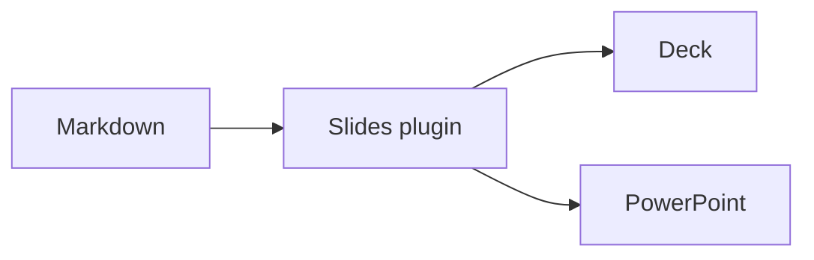

<!-- layout: cover -->
<!-- paginate: false -->

# Markdown Slides Editor Online

This guide is also a presentation, and it uses every layout and directive the slides plugin has. Read it as a document, open **Source** to edit it, or choose **Present** to turn the same Markdown into slides.

```sh
npm install @react-markdown-kit/renderer @react-markdown-kit/slides
```

???

The cover layout centers the slide and makes the heading bigger. This slide also turns off the page number that the front matter turns on for the rest of the deck.

---

## One document, several slides

A line of three dashes, with a blank line on each side, starts a new slide. The rules separating this guide's sections are its slide breaks.

```md
# The first slide

An idea worth sharing.

---

## The next slide

The details behind it.
```

This slide has no layout directive, so it uses `default`.

---

<!-- layout: section -->
<!-- transition: slide -->

## Layouts

`<!-- layout: … -->` picks one of nine: `default`, `cover`, `section`, `center`, `two-cols`, `image-left`, `image-right`, `quote` and `fact`. Each one has a slide in this deck.

---

<!-- layout: two-cols -->

## Add the plugin

```tsx
import Markdown from
  '@react-markdown-kit/renderer'
import { slides } from
  '@react-markdown-kit/slides/present'

<Markdown extensions={[slides()]}>
  {source}
</Markdown>
```

::right::

The root `@react-markdown-kit/slides` entry renders static slides. The `/present` entry adds presentation controls and keyboard navigation.

This is the `two-cols` layout. Everything after a `::right::` line goes in the second column.

---

<!-- layout: center -->

## Front matter sets the defaults

The `---` block at the top of this file sets the title, a fade transition, the footer and page numbers for every slide. A slide's own directive wins over it.

---

<!-- layout: image-right -->
<!-- image: /img/slides/cards.svg -->

## A picture on the right

`<!-- image: … -->` gives the slide a picture, and `image-right` puts it on the right half.

The text keeps the other half. Without one of the two image layouts the picture isn't shown.

---

<!-- layout: image-left -->
<!-- image: /img/slides/cards.svg -->

## A picture on the left

`image-left` is the same slide mirrored. The picture fills its half and is cropped to fit.

---

<!-- layout: quote -->

> Write the talk in the same file you'd send someone to read. The slides come from the headings and the breaks.

The `quote` layout makes a block quote the whole slide.

---

<!-- layout: fact -->
<!-- transition: zoom -->

## 9

Layouts, one directive each. `fact` shows one number or word as big as it fits.

---

<!-- background: /img/slides/grid.svg -->
<!-- class: inverse, bottom -->

## A background and some classes

`<!-- background: … -->` puts a picture behind the whole slide. `<!-- class: … -->` adds classes: `inverse` for light text on a dark surface and `bottom` to push the content down.

The other built-in classes are `left`, `center`, `right`, `top` and `middle`. Any other class is yours to style.

---

## Reveal it in steps

A `--` line reveals the next part on another keypress.

--

This paragraph is the first step.

--

And this one is the second. Speaker notes start at a `???` line and show in the presenter view.

???

Press P to see these notes in the presenter view. They never show on the slide itself.

---

<!-- incremental: true -->

## Lists one item at a time

With `<!-- incremental: true -->` each item of a list is its own step.

- Headings become slide titles
- Lists turn into talking points
- Fenced blocks stay code examples
- Tables stay tables

---

## Highlight code in steps

Put line ranges in braces after the fence's language. Each `|` is another step.

```ts {1|3-5|all}
import { slides } from '@react-markdown-kit/slides/present'

const extensions = [
  gfm(),
  slides({ aspect: '16:9' }),
]
```

---

## Keep using Markdown

Headings, paragraphs, **bold text**, lists, tables and code fences work inside a slide.

| In your document | In your presentation |
| --- | --- |
| A heading | The slide's title |
| A list | Your talking points |
| A fenced block | A code example |
| A Markdown table | The same table |

***

A `***` line stays a rule inside the slide. Use the same GFM preset in your editor and renderer to keep their syntax in sync.

---

## Diagrams in a slide

This demo also loads the Mermaid plugin, so a `mermaid` fence renders as a diagram.



---

<!-- name: keys -->

## Try presenting

Choose **Present**, then use the arrow keys to move through this guide. Press **Escape** to return to the document.

| Key | Action |
| --- | --- |
| Right or Space | Next slide or step |
| Left | Previous slide or step |
| O | Overview |
| P | Presenter view |
| ? | Keyboard shortcuts |

???

`<!-- name: keys -->` gives this slide the anchor `#slide-keys`.

---

<!-- layout: center -->
<!-- footer: Press ? in present mode for the full list of keys -->

## Share it

Open **More** for the presenter window, streaming playback, printing and PowerPoint export. **Copy link** shares the document without uploading it.

The [slides reference](/docs/slides) covers every directive. This slide's own footer replaces the one from the front matter.
